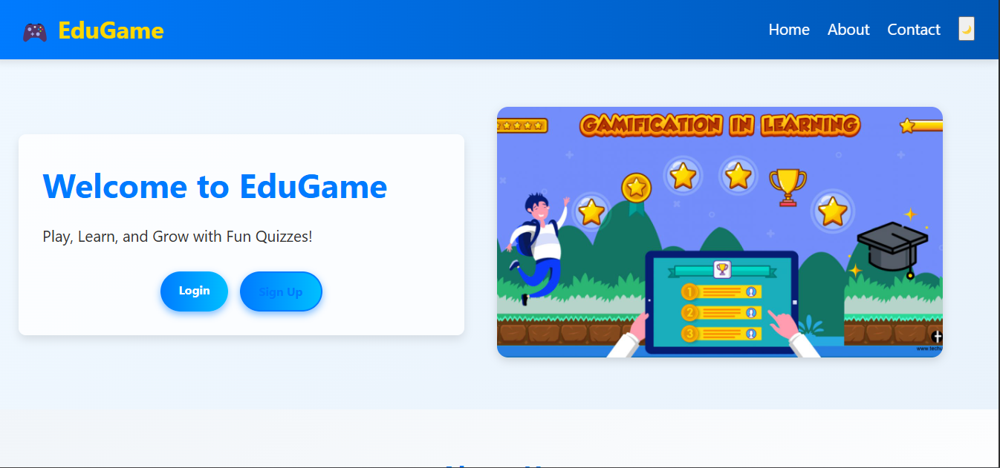
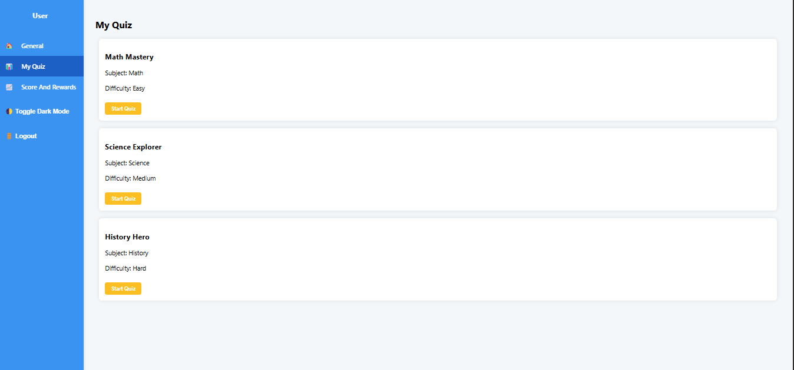
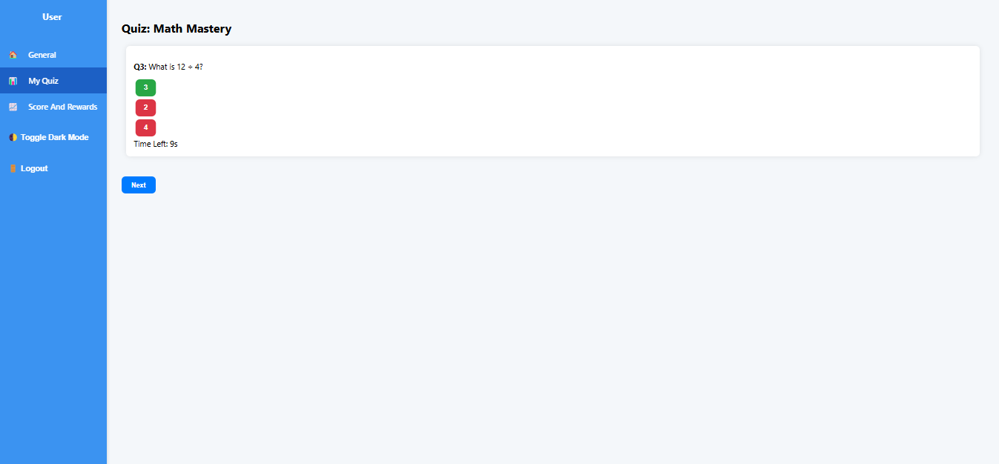

### Educational Gamification App  
### Introduction 
The Educational Gamification App is designed to make learning fun and engaging through interactive quizzes, challenges, and rewards. The main goal of this project is to encourage students to learn new topics in an exciting way while tracking their progress and achievements. It solves the problem of low motivation in traditional learning by integrating game mechanics like points, badges, and leaderboards. 
### Project Type
Frontend
### Deployed App
Frontend: ### deployed link:- https://spiffy-faloodeh-c53f2d.netlify.app/  
### Directory Structure
educational-gamification-app/ ├─ home.html
├─ home.css
├─ home.js
├─ Signup.html
├─ signup.css
├─ signup.js
├─ login.html
├─ login.css
├─ login.js
├─ firebase.js
├─ dashbaord.html
├─ dashbaoard.css
├─ dashbaord.js
├─ images/
├─ edugame.png
├─ quizData.json
├─ quizQuestions.json  

### Video Walkthrough of the Project
Attach a very short video walkthrough of all the features [1 - 3 minutes].
video link Project Visual Presentation:-### https://youtu.be/4w7syUyYtIc

### Video Walkthrough of the Codebase
Attach a very short video walkthrough of the codebase [1 - 5 minutes].
Video link Project Codebase :-### https://youtu.be/6IWpQE0LFfM

### Features:-
1️⃣User Registration and Login using Firebase Authentication  
2️⃣Gamified quizzes with points and feedback  
3️⃣Progress tracking and achievement badges  
4️⃣Responsive design for mobile and desktop  

### Design Decisions or Assumptions:-  
1️⃣Chose Firebase Authentication for quick, secure login/signup without backend development. 
2️⃣Designed a minimalistic UI to ensure focus remains on educational content. 
3️⃣Assumed that all users would have internet access (since Firebase services require internet). 
4️⃣Used localStorage temporarily for storing quiz scores. 

### Firebase Setup:

i)Create a Firebase project. 

ii)Enable Email/Password Authentication. 

iii)Copy your Firebase config and paste it into script.js where indicated. 

### Usage:- 
i)Once you open the app: 

ii)Sign up or log in. 

iii)Start quizzes and earn points. 

iv)Unlock achievements as you progress. 

iv)Check your rank on the leaderboard. 

### Screenshots:

### Landing Page

### Quiz Section

### Quiz Attempt Page

### Score And Reward Page

### You can use the following test credentials:

Email: testuser@example.com

Password: 123456

Or create your own account using signup.

### Technology Stack:-
HTML5
CSS3
JavaScript (ES6)
Firebase Authentication

