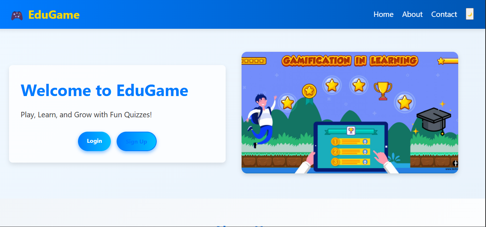

Educational Gamification App
Introduction
The Educational Gamification App is designed to make learning fun and engaging through interactive quizzes, challenges, and rewards. The main goal of this project is to encourage students to learn new topics in an exciting way while tracking their progress and achievements. It solves the problem of low motivation in traditional learning by integrating game mechanics like points, badges, and leaderboards.
Project Type
Frontend
Deployed App
Frontend: https://spiffy-faloodeh-c53f2d.netlify.app/
Directory Structure
educational-gamification-app/ ├─ home.html
├─ home.css
├─ home.js
├─ Signup.html
├─ signup.css
├─ signup.js
├─ login.html
├─ login.css
├─ login.js
├─ firebase.js
├─ dashbaord.html
├─ dashbaoard.css
├─ dashbaord.js
├─ images/
├─ edugame.png
├─ quizData.json
├─ quizQuestions.json

Video Walkthrough of the Project
Attach a very short video walkthrough of all the features [1 - 3 minutes].

Video Walkthrough of the Codebase
Attach a very short video walkthrough of the codebase [1 - 5 minutes].

Features:-
1️⃣User Registration and Login using Firebase Authentication
2️⃣Gamified quizzes with points and feedback
3️⃣Progress tracking and achievement badges
4️⃣Responsive design for mobile and desktop

Design Decisions or Assumptions:-
1️⃣Chose Firebase Authentication for quick, secure login/signup without backend development.
2️⃣Designed a minimalistic UI to ensure focus remains on educational content.
3️⃣Assumed that all users would have internet access (since Firebase services require internet).
4️⃣Used localStorage temporarily for storing quiz scores.

Firebase Setup:

i)Create a Firebase project.

ii)Enable Email/Password Authentication.

iii)Copy your Firebase config and paste it into script.js where indicated.

Usage:-
i)Once you open the app:

ii)Sign up or log in.

iii)Start quizzes and earn points.

iv)Unlock achievements as you progress.

iv)Check your rank on the leaderboard.

Screenshots:

Landing Page

Quiz Interface

Leaderboard

Credentials
You can use the following test credentials:

Email: testuser@example.com

Password: 123456

Or create your own account using signup.

Technology Stack:-
HTML5
CSS3
JavaScript (ES6)
Firebase Authentication

